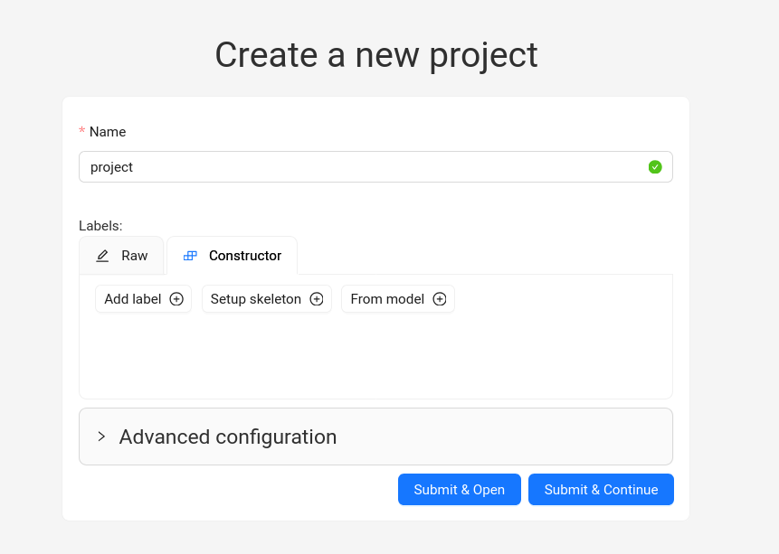

# gizmo_arcade_game
A repository for the Gizmo 2025 Build Your Own Arcade Game Summer Camp

## Introduction
In this camp, we are going to build an object detector. You will do this using artificial intelligence (AI). There are a few steps to completing this task. 

- [ ] Decide what object you want to build a detector for
- [ ] Take pictures of the object - you'll want between 60-100 images
- [ ] Move the pictures from the camera to your file system 
- [ ] **Annotate** your images using CVAT
- [ ] Train the model using the annotated images 
- [ ] Download the model 
- [ ] Use the model with the python script on the Raspberry Pi Computer 

## Decide What Object You Want to Build a Detector For 
In this step, you will decide what object you most want to use for your game. Remember, the object you pick will help decide the game's score. Pick something small that you will be able to see inside your game. 

## Take Pictures of the Object
This is the fun part - your object photoshoot! 
You will want to take between 60-100 pictures total. Most of them will have your object inside the picture, but some of the pictures should not have the object at all. I would suggest taking at least 10-20 pictures that don't have your object in them. Here are some of the other types of pictures you want to take. I suggest a good mix of these:

- Pictures with your object close to the camera
- Pictures with your object far away from the camera
- Pictures with your object a medium distance away from the camera
- Pictures with your object partially hidden by something else
- Pictures with your object in dark lighting
- Pictures with your object in bright lighting
- Pictures with your object in room lighting 
- Pictures with your object on its side
- Pictures with you object upside-down
- Pictures with your object from behind 
- Pictures where it is hard to see your object
- Pictures with your object against different backgrounds 
- Pictures without your object in them 

## Move the Pictures from Your Camera to Your File System 
Now that you have taken the pictures, you need to move them to your file system. Your instructor should be able to tell you how to do this. When they are off your filesystem, you are going to sort them into three folders. 

If you look at this repository (in Github, which we are using, a collection of files related to the project is called a **repository** or **repo** for short), you will see that there is a folder called **dataset**.
Inside the **dataset** folder, there is a folder called **images**.
Inside the **images** folder, there are three different folders, called **test**, **train**, and **val**. 

The structure looks like this: 

- dataset
    - images 
        - test
        - train 
        - val 

    
All of these folders - test, train, and val - are used to train or measure the model we will be making for the project. The **train** folder is where most of your images will go. This is the main folder that the AI model will be looking at when trying to improve itself. The **val** folder is where the AI model will be looking while it's training to see if it's doing a good job. And the **test** folder will be the images the AI model won't get to see until its finished training, to see how good it's final performance is. 

When you move the pictures, here is what we suggest

- Put about 10 images in the **val** folder (most with your object, 1-2 without it)
- Put about 10 images in the **test** folder (most with your object, 1-2 without it, just like the val folder)
- Put the rest of the images in the **train** folder. Make sure some of these don't have the object, too! 

## Annotate Your Images using CVAT
In this step, we will be **annotating** the images. In AI machine vision terms, **annotating** is where you tell the AI model where the object is inside the image (as well as what object it is). This can be a long job! It is helpful to have some software tools to be able to help us with this. Without the annotations, the AI model doesn't have good, labeled data to train on. 

We will be using an online annotation tool called CVAT. Here are the steps you will want to follow: 

1. Go to the [CVAT Website](https://www.cvat.ai/) linked here. 
2. Your instructor will likely have an account that they want you to use, so make sure to check with the instructor before going farther. If there is not an account already made, you will need to make one and log into it. 
3. When you login to CVAT, you will need to make a new project. Click the word "Projects" on the navigation bar on top of the screen. 


4. When you are on the projects page, click the blue plus sign to create a new project.


5. Click "Create New Project"


6. This brings you to the "Create New Project" Screen. Name your project, "project", all lowercase. 



7. Then, under the "Labels" heading, click "add label". This will open the constructor tab. 


8. Type "object" where the box has a greyed-out "Label name" written. Then, click continue. The page box will go blank, but your label has saved. If you want to check, if you go back to the "raw" tab, your label will be written there. 


9. This will take you to the project description page, where you can see your project info. Under this project, we will now add tasks. Click the blue plus sign at the bottom of the page to add a task.


10. Then click, "Create a New Task"


11. You will name this task, "train", all lowercase. Under "Subset", you will click to get a dropdown menu, and pick "Train". 


12. Under the "Labels" heading, you will see a file selector. This is where you all add **all the images** from **only the 'train' folder**. You can either click to naviagte there, or you can select all the photos from the folder and drag them in. Feel free to ask for help if you aren't sure how to get the files uploaded.  It can be a little hard to tell, but you should see a little line of text that says "X files selected", where X is the number of pictures you picked. 


13. Now, click "Submit & Open". You will see a small message saying "CVAT is uploading task data to the server" with a percentage mark. This may take a little while. 


14. When the files are finished uploading, you will see a task information page, like the one below. It will have created a new Annotation job with a random number name. This is what we will open to annotate our images! Go ahead and click the blue text job name to open it. It may take a minute or 2 to open. 


15. The initial annotation screen will look something like this. It can be a bit overwhelming, but we'll go through what to do step-by-step. 


16. We will be using the box tool to draw boxes around the objects in our image. On the side menu, there is a little box symbol (with nothing inside it -- different from the box symbol further up on the page). Go ahead and click on the box symbol. 


17. This will bring up the box symbol draw options. It will automatically fill in the "object" label you created with the project. Under drawing method, it will have "By 2 Points" already selected, which is good. Go ahead and click "Shape" to start drawing your box. 


18. This will "load" your cursor with red lines (cross-hairs) that allow you to see where your cursor is exactly. You will click once at the top left of the object, and once at the bottom right of the object to create the box around it. When the box is drawn, it will show up with handles. You can adjust the handles to better capture your object if it wasn't quite perfect the first time.


19. You have just annotated your first object! You can now click the "next" arrow to repeat with the next picture. The keyboard shortcut to do this automatically is pressing "f" on the keyboard. 


20. You will keep drawing boxes around the objects in your images until you are finished. Here are some tips. 
- Pressing 'n' on your keyboard will bring up the box to draw automatically, do you don't have to click the box symbol each time
- Pressing 'f' on the keyboard moves to the next picture
- If the picture doesn't have your object in it, you don't have to do anything -- just click the next button or 'f'
- You will periodically want to save your job by clicking the save button on top of the screen. 


- if the object is partly hidden by something, it's okay to draw the box around **where you think the rest of the object would be**. 
- If there is more than one object in a picture, its okay if the boxes overlap. 

21. When you finish annotating, make sure you click the save button. Then you can click the "tasks" button on the navigation bar on top of your screen. 


22. This will bring up your tasks summary. You should be able to see your "train" task. 


23. Where it says "Actions" on your task summary, go ahead and click the three dots menu. Then click "Export task dataset"


24. This will bring up a new box. You will change the "Export format" field to "Ultralytics YOLO Detection 1.0". You may have to scroll a little while to find it. Then you will change the custom name to "train". After that, click OK.


25. This will pop up a box in the corner, that says "Annotation export started". Click the link that says you can check progress and download the file here. 


26. When you click the link, it will take you to the "Requests" tab. When it's finished, you will get "100%" on the export annotation request. 


27. Click the three dots to the side of the request, and click the "Download" button. This will download a zip file to your computer. 


28. Where the file downloaded, you will want to "unzip" the file. Depending on what computer you are using, you might have to right-click the file and click "unzip", or "extract", or "extract here". 

29. You will get a file structure that looks like this:

- train
 - data.yaml
 - labels
    - Train
        - bunch of .txt files
 - Train.txt

We only care about the stuff inside the labels/Train folder. Copy all of the .txt files inside that folder into your **dataset/labels/train** folder inside of the repository where you have been working. 

We actually do use a .yaml file, but we are modifying it slightly, so don't worry for now about the one the downloaded. 

30. Now we will repeat Steps 9-29 for the "val" and "test" set. When you click the "Projects" tab, and then click into your "project" project, you can create new tasks for these. Go ahead and repeat steps 9-29, except for the validation set, substitute "val" wherever you see "train" and for the "test" set, substitute "test" wherever you see "train". 

For example, see how the "test" task is set up below. 


31. When you are finished, your **dataset** folder inside your repository setup should look like this:

- dataset 
    - data.yaml
    - images
        - test
            - bunch of test images
        - train
            - bunch of train images
        - val 
            - bunch of val images
    - labels
        - test 
            - bunch of test .txt files 
        - train
            - bunch of train .txt files 
        - val 
            - bunch of val .txt files 


**You should now delete the "placeholder.txt" files from each folder.**

### The .txt files 
If you look an individual .txt file, you will see something in it like this

    0 0.440658 0.468328 0.151737 0.201093

Each line in the txt file is composed of a classification label and bounding box coordinates. In the above example, there is one object, since there is only one line. The object is of class '0', which is the index - in this case, we only have one class, the "object" class, so this will be classified/labeled 'object'. The 
"0.440658 0.468328 0.151737 0.201093" are the coordinates of the bounding box in the picture that outlines the object. They are usually expressed in terms of percentage of the picture size. 

### The .yaml file 
The .yaml file was setup so you shouldn't have to make any changes. This is the file the model will be looking at to know what it should use as its test, train, and validation images sets and labels. 

Our .yaml file looks like this:

    names:
        0: object
    path: /content/drive/My Drive/dataset
    train: images/train
    val: images/val
    test: images/test

The line:

    names:
        0: object

describes the classes present in our dataset that we will be detecting. In this case, we are only looking for one thing, an "object" classes, indexed by 0 in our label .txt files. 

The line: 

    path: /content/drive/My Drive/dataset

Gives the base folder for our dataset. We are going to mount our dataset in Google Drive, which which is why the base path goes through the mounting location. Our main folder is called "dataset", which is the last part of the path. 

The lines: 

    train: images/train
    val: images/val
    test: images/test

Describe where our training, validation, and test images are located inside the "dataset" folder. 

We are now ready to train our model inside Google Colab!

## Train the Model Using the Annotated Images 
We will be training the AI model using Google Colab. Colab allows free, short-term access to specialized resources called GPUs and TPUs. Both GPUs and TPUs are specialized computer hardware chips that allow you to do certain mathemetical operations faster and more efficiently than in a CPU. These math operations are common in AI model training (although, fun fact - the popularity of GPUs initially came out of the video game industry, as video games need images to render quickly). You may have a GPU already in your laptop, but installing the drivers needed to use it for AI model training can be difficult and time consuming. For this workshop, we'll use Google's instead. 

We will start by uploading the dataset. 


1. Log on to your Google Drive account (your instructor should have an account for you to log onto. If not, you can create a free account.)

2. Click on the "+ New" button in the top left corner. 


3. Click "Folder Upload" 


4. Navigate to where you have the "dataset" folder stored in this repo, and upload it. If it asks you if you are sure you want to upload, you can go ahead and click "upload". It may take a few minutes to upload the entire folder. 

5. You will also want to upload the notebook code file we will be using to train the model. Click the "+ New" Button, and then "File Upload". The naviagte to the "code" folder of the repo and click on "Object_Detector.ipynb"

    - code 
        - Object_Detector.ipynb (this is the file you want to upload)
    - dataset
    - docs
    - README.md


6. When the "Object_Detector.ipynb" file is uploaded, double click on it to open it in Google Colab. 

Google Colab runs python notebooks. Notebook files are a little different in that they can run sections of code at a time ("code cells"). This is useful for debugging, although you also have the opportunity to run cells out of order, which once in a while can lead to some frustrating bugs. 

7. First, you will want to make sure the Runtime type is correct (that it is using specialized hardware to train the model). Go to the top file bar and click "Runtime" 


8. Click "Change Runtime Type"


9. This will bring you to the runtime window. You want to be sure something **other** than "CPU" is selected. Anything other than CPU should give you a significant speed boost. 


10. Now we can actually run the file. You can click "Runtime" at the top and then "Run All". When you get to the cell where your Google Drive is mounted, you will have to click "yes", and "accept", and "allow" a bunch of times to allow Google Colab to access your drive. This can be a multi-step and duo-factor process, so be prepared! 

Lets break down the code, cell by cell 

    %pip install ultralytics
    import ultralytics
    ultralytics.checks()

This code installs the ultralytics package, which is what we are using to use the YOLO model specifically. It then imports the packages and does checking to ensure everything looks good. 

The output should look something like this: 


The next code cell looks like:

    #Mount google drive and get the data loaded in
    from google.colab import drive
    drive.mount('/content/drive')

This is where we are mounting your Google Drive. That way, Google Colab can access the files it needs to train the model. This is also where you'll have to click through a bunch of permissions access files. 


The next cell looks like: 

    from ultralytics import YOLO
    #Load a model
    model = YOLO("yolov8n.pt")
    #load a pretrained model (recommended for training)
    #Train the model
    results = model.train(data="/content/drive/My Drive/dataset/data.yaml",
                        epochs=50)

This is the main training cell. It imports the yolo model, and loads a pretrained version. Then, it tells you where to look for the the training dataset for the custom object, and tells it to train another 50 epochs (which is 50 times through the training data) 

You will get a lot of output, mostly reporting metrics for the model performance by epoch. 


This step may take some time. Model training can be slow going, even with a relatively small dataset like this. The specialized hardware really comes in handy!

Your final model output from this cell should look something like this. 


With that, your model is done training! The final code cell looks like:

    model.export()

This gives you the option to export the model into a custom version. We aren't really using that for this project. 

## Download the Model 
Now that the model is trained, we need to download it, so we can use it. One disadvantage of using Google Colab is that output from your programs are tied to your runtime - which will disconnect after an hour or so of use, or after it is inactive too long. So, your final trained model file will disappear when the runtime disconnects. After your model finishes training, I recommend downloading it somewhat quickly to avoid this!

1. Click the file icon on the left side of the colab. This will open the file tree. 


2. The model file you need is located  at 'runs/detect/train/weights/best.pt'. Navigate through the file tree until you find this file


3. Right click the file and download it. 


This will download a .pt file. It may look like a file type you would unzip, but in this case, you will not unzip it. 

## (Optional) Test the Model with a Laptop with a Camera 
If you have access to a computer with OpenCV installed for python and a webcam, you can test your model. Move the "best.pt" file into the "code" folder in the repository, so your file tree looks like this:

    - code 
        - best.pt (the model file)
        - test_model_with_computer_camera.py (the file we will run)

Then, open a terminal in the code folder. On the terminal, run this command 

```bash
    python3 test_model_with_computer_camera.py 
```

A little window should pop up with the webcam. When you hold your object in front of it, it should try and draw a box around the object with the label "object", and a number, which corresponds to the % confidence the model has that the object inside the box is correctly classified. 

## Use the Model with the Python Script on the Raspberry Pi Computer
Transfer the model over to the raspberry pi with scp or a thumdrive. 
1. Open a terminal on your computer
2. Get the raspberry pi's ip address
3. Run this command in the terminal where the best.pt file is located 
    
```bash
    scp best.pt pi@"replace with pi ip address":/home/pi/gizmo_arcade_game/code/best.pt
```

The pi's username is **pi** and the password is **raspberry**

You can test the file by running the terminal command (inside the code file)

```bash
    python3 pi_object_game_score.py
```

That should bring up the game window and score!


